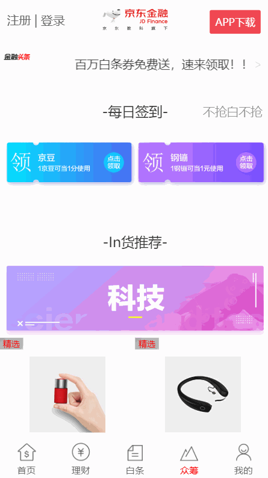

## 组件化思维与技巧——京东金融项目

本项目使用的是Vue.js实现的组件化。在模块化方面不仅涉及常规的JS还有CSS，CSS的模块化使用Sass组织代码，将模块化设计做到极致。

**体验地址**

请使用手机扫码体验（建议使用**夸克/UC/chrome浏览器**，因为微信可能需要多刷新一两次。）

**如果实在无法访问，可查看下面gif图**

**整体预览👇**

**首页👇**

**理财👇**

**白条👇**

**众筹👇**

 

**——Young丶TCY**

